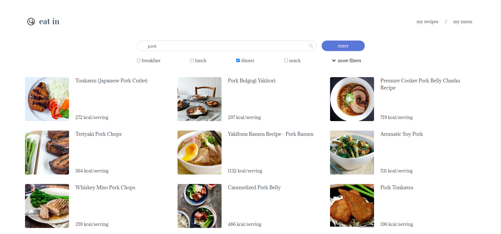
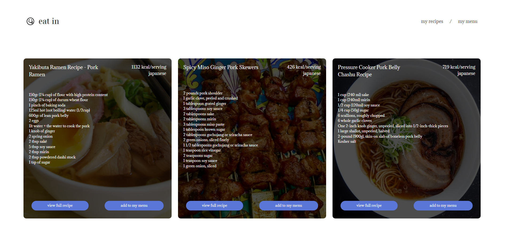
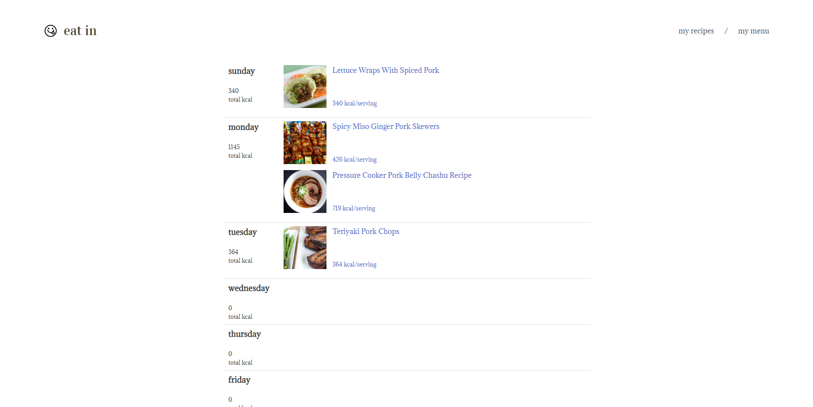

#  eat in: meal planning made simple
eat in is an app that allows you to search for recipes and plan your meals. Powered by the [edamame API](https://www.edamam.com/). 

Live site: https://vivianli1.github.io/Meal-Plan-App/

## Features
- Search for recipes with a keyword and various filters
  - Filter by meal, restrictions, diet, and cuisine
- Add recipes to your saved recipes
- Add recipes to your menu sorted by day
  - View your daily calorie count  

## Screenshots

## Built with
- [edamame API](https://www.edamam.com/)
- [Bulma](https://bulma.io/)

## Future Development Goals
- User sign in/sign up
  - save user recipes/menus to database
- More filter options
- Abilbity to print/email menu 

## Author
Github: [@VivianLi1](https://github.com/VivianLi1)

LinkedIn: [Vivian Li](https://www.linkedin.com/in/vivian-li-39188b171/)
